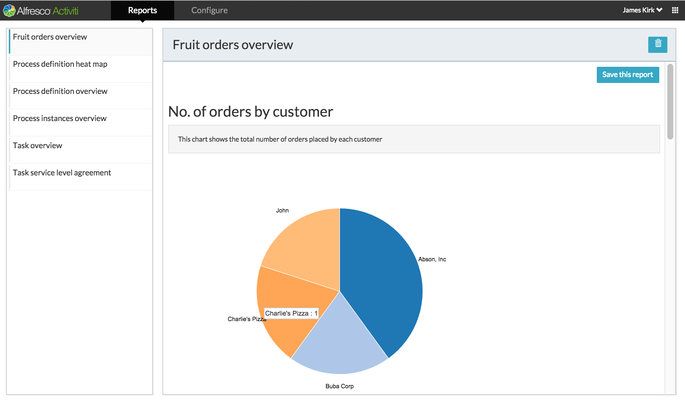

Example Custom Reports for Activiti BPM Suite
====

This project provides an example report which displays some custom charts based on variables, for an example process.

Prerequisites
---

This project is built against Activiti Enterprise artifacts and assumes that you have access to these via Maven.

The provided pom file references the required Enterprise repositories on `artifacts.alfresco.com` but you will need to have some [credentials configured](https://maven.apache.org/guides/mini/guide-encryption.html) for these in your `.m2/settings.xml` file. The repository IDs are `activiti-enterprise-releases` and `activiti-enterprise-snapshots`.

In order to run the tests and the Activiti BPM Suite WAR you will also need a valid Activiti license installed in the directory `$HOME/.activiti/enterprise-license`.

Building, Testing, Running
---
To build the JAR file via Maven

    mvn clean install

A basic set of integration tests will be run. If you want to disable these then you can do so via the standard `-DskipTests` method.

To run the Activiti BPM Suite with the JAR file customisations applied, use the `run-war` profile

    mvn clean install -Prun-war

This will start up an instance of Tomcat running on port 9999 on your local machine. To get to the Activiti BPM suite, navigate to `http://localhost:9999/activiti-app` in your web browser. You can log in using the username `admin` and password `k1ngk0ng`.